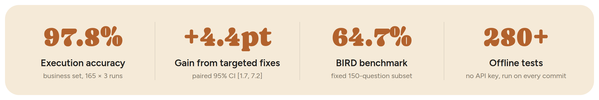
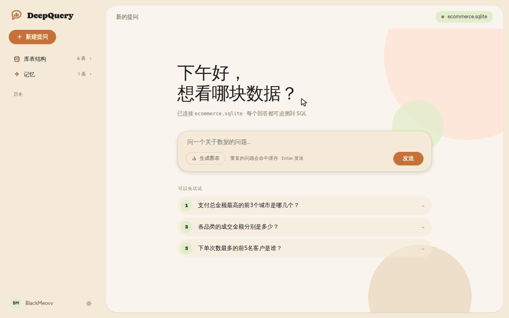

<div align="center">


# DeepQuery

**Ask your database in plain language and get answers you can trace and verify**

Data-question agent · Natural language to SQL · Built-in evaluation loop

[](https://github.com/BlackMeovv/DeepQuery/actions/workflows/ci.yml)


[Quick start](#quick-start) · [Results](#results) · [Deploy](docs/DEPLOY.md) · [中文](README.md)

</div>

<br>

<picture>
  <source media="(prefers-color-scheme: dark)" srcset="docs/assets/metrics-en-dark.png">
  
</picture>



## Highlights

Getting a model to write SQL is easy; getting people to trust the result is not.
DeepQuery keeps reliability in deterministic code instead of relying on the model.

<table>
<tr>
<td width="33%" valign="top">

**🛡️ Syntax-tree guard**

Only a single SELECT over allowlisted tables passes, with a forced row limit; the database layer then runs it read-only

</td>
<td width="33%" valign="top">

**🔢 Number provenance**

Every number in an answer must appear in the result, the question or the SQL; otherwise the model rewrites once, then only the raw table is shown

</td>
<td width="33%" valign="top">

**🔁 Error-aware repair**

Missing tables or columns, syntax errors, timeouts and empty results each get targeted hints; rounds and token/cost budgets are hard-capped

</td>
</tr>
<tr>
<td width="33%" valign="top">

**📊 Reproducible evaluation**

A 236-question in-house set plus BIRD; clustered confidence intervals, and every change is compared question-by-question

</td>
<td width="33%" valign="top">

**🧭 Context engineering**

The full schema is used when it fits; above a size threshold it is disclosed progressively: a table catalog first (about 11–15% of the full definitions), then full definitions of the tables the model picks, and real column values on demand. Glossary, examples and user memory are injected on demand

</td>
<td width="33%" valign="top">

**⚡ Traceable by design**

Steps and answers stream token by token; every answer expands to the SQL it ran, the raw result and the injected context

</td>
</tr>
<tr>
<td width="33%" valign="top">

**🙋 Asks before guessing**

Undefined terms like "best customer" get a short list of interpretations to pick from instead of a guess; questions about data that doesn't exist get an explanation and answerable alternatives

</td>
<td width="33%" valign="top">

**🧠 Follow-ups and memory**

Follow-up questions ("what about by state?") carry the previous questions and SQL as context; saved definitions and preferences are applied to every later question, so a defined term is never asked about again, and on a public deployment each visitor's memory is isolated

</td>
<td width="33%" valign="top">

**🔌 Many front doors**

Web UI, CLI and an MCP server share one agent; SQLite / MySQL / PostgreSQL via read-only connections, switching databases is a connection string

</td>
</tr>
<tr>
<td width="33%" valign="top">

**🔍 Deep analysis**

"Why did March sales go up?" is split into several queries that run in parallel, with an optional drill-down after seeing the results; every sentence of the conclusion cites its step, and each number is checked against the step it cites

</td>
<td width="33%" valign="top">

**🔄 Feedback loop**

Every answer can be rated 👍/👎; the run log doubles as an audit log, and downvoted runs export with their question, context and SQL as eval cases waiting for a gold answer

</td>
<td width="33%" valign="top">

**🗳️ Candidate voting**

Optional: sample a second SQL and accept when both return the same result; on disagreement sample more and take the majority result, so extra cost is only spent on hard questions

</td>
</tr>
</table>

## Results

Model: gpt-5.5 via an OpenAI-compatible API. Raw per-question results live in
[eval/results/](eval/results/); `make report` recomputes this table from them.

| Set | Config | EX (95% CI) |
|---|---|---|
| Business dev · 165 × 3 runs | baseline | 93.3% [90.1, 95.6] |
| Business dev · 165 × 3 runs | glossary injection + output rules | **97.8%** [95.5, 98.9] |
| Business holdout · 71 × 3 runs | same (never run during tuning) | **97.7%** [92.3, 99.3] |
| BIRD dev · fixed 150-question subset | full schema in context | **64.7%** [56.7, 71.9] |
| BIRD dev · fixed 150-question subset | retrieved tables only | 61.3% [53.3, 68.8] |

- **Failure-driven fixes produced a real gain.** Paired by question: +4.4 points, 95% CI [+1.7, +7.2];
  23 questions improved, 7 regressed, sign test p = 0.005.
- **An ablation changed the design.** On BIRD, retrieval vs. full schema differs by +3.3 points,
  95% CI [−2.1, +8.7] — indistinguishable — while retrieval saves only ~3% of tokens and adds a
  recall failure point (95.5% table recall). The full schema is now the default below a size threshold.

<sub>EX is execution accuracy (result sets are compared, not SQL text), as in BIRD / Spider. Three runs of the
same question are correlated, so intervals use a per-question design effect (1.52 on dev, 2.21 on holdout).</sub>

## Quick start

Requires [uv](https://docs.astral.sh/uv/) and any OpenAI-compatible model API.

```bash
make install
cp .env.example .env          # set LLM_API_KEY / LLM_BASE_URL / LLM_MODEL
make demo-db                  # fictional e-commerce data: 240 customers, 36 products, 1,500 orders
make olist-db                 # optional: real Olist Brazilian e-commerce data (~100k orders); point DB_PATH at it
make ask Q="Which 5 customers placed the most orders?"
make serve                    # web UI at http://localhost:8000
make test                     # 280+ offline tests, no API key needed
```

Point `--db` at any SQLite file or a `mysql://` / `postgres://` DSN; use a read-only database
account in production. Server deployment: [docs/DEPLOY.md](docs/DEPLOY.md).
